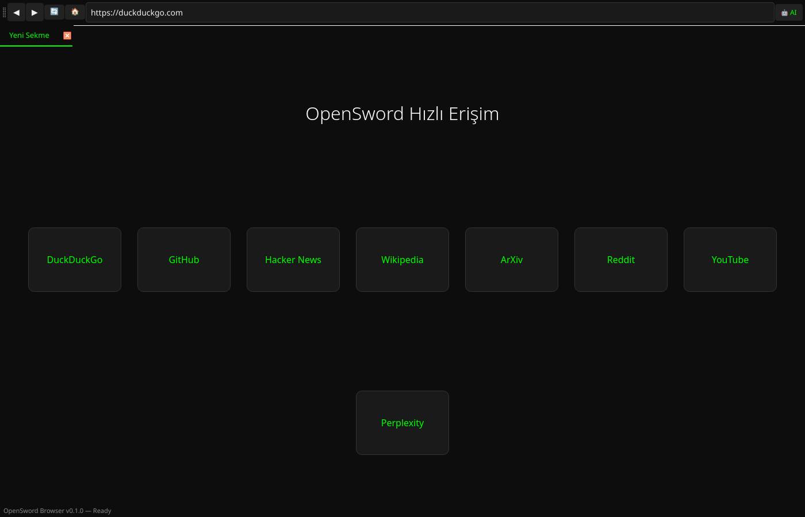

# ⚔️ OpenSword Browser

> **Açık kaynak, AI-native, modern web tarayıcısı.**
> Rakipler: [Dia Browser](https://www.browser.company/dia) (Browser Company) & [Perplexity Comet](https://www.perplexity.ai/comet)
> Farkımız: %100 açık kaynak, yerel AI desteği, topluluk gücü.

[](https://opensource.org/licenses/Apache-2.0)
[](https://python.org)
[](https://www.qt.io)

---

## 🚀 Özellikler

| Özellik | Açıklama |
|---------|----------|
| **Çoklu Sekme** | Hızlı, sürüklenebilir, kapatılabilir sekmeler |
| **AI Yan Paneli** | OpenAI, Groq, Anthropic, Ollama desteği |
| **Komut Paleti** | `Ctrl+K` ile hızlı komut erişimi |
| **Yer İmleri** | Hızlı erişim çubuğu + JSON yönetimi |
| **Gizli Mod** | `Ctrl+Shift+N` ile özel gözatma |
| **Koyu Tema** | Göz yormayan, modern siyah arayüz |
| **DuckDuckGo** | Varsayılan arama motoru (gizlilik odaklı) |
| **Hızlı Kısayollar** | Vim/VSCode tarzı kısayollar |

---

## 📢 Kurulum

```bash
# 1. Depoyu klonla
git clone https://github.com/hiimhermes-self/opensword-browser.git
cd opensword-browser

# 2. Bağımlılıkları kur (Arch)
sudo pacman -S python-pyside6

# veya pip ile
pip install -r requirements.txt

# 3. Çalıştır
python -m opensword.browser
```

---

## 🎮 Kısayollar

| Kısayol | İşlem |
|--------|--------|
| `Ctrl+T` | Yeni sekme |
| `Ctrl+W` | Sekmeyi kapat |
| `Ctrl+Shift+T` | Son kapanan sekmeyi geri getir |
| `Ctrl+Tab` | Sonraki sekme |
| `Ctrl+R` | Yenile |
| `Ctrl+K` | Komut paleti |
| `Ctrl+Shift+A` | AI paneli aç/kapat |
| `Ctrl+D` | Yer imi ekle |
| `Ctrl+L` | Adres çubuğu |
| `F12` | Geliştirici araçları |

---

## 🤖 AI Entegrasyonu

Sağ panelden API sağlayıcınızı ve anahtarınızı yapılandırın. Yakında:
- Sayfa özeti
- Seçili metin çeviri
- Chat-tab entegrasyonu
- Yerel Ollama desteği

---

## Ekran Goruntuleri



## Proje Yapisi

```
opensword-browser/
├── opensword/
│   ├── __init__.py
│   ├── browser.py       # Ana pencere & sekmeler
│   └── main.py          # Giriş noktası
├── requirements.txt
├── README.md
└── LICENSE
```

---

## 🌱 Katkı

Katkılar açıktır! Issue açın, PR gönderin, çatallayın (fork).

---

## 📜 Lisans

Apache 2.0 — Detaylar için [LICENSE](./LICENSE) dosyasına bakın.

---

> *"Tarayıcıların geleceği açık kaynakta, kapalı duvarlarda değil."*
